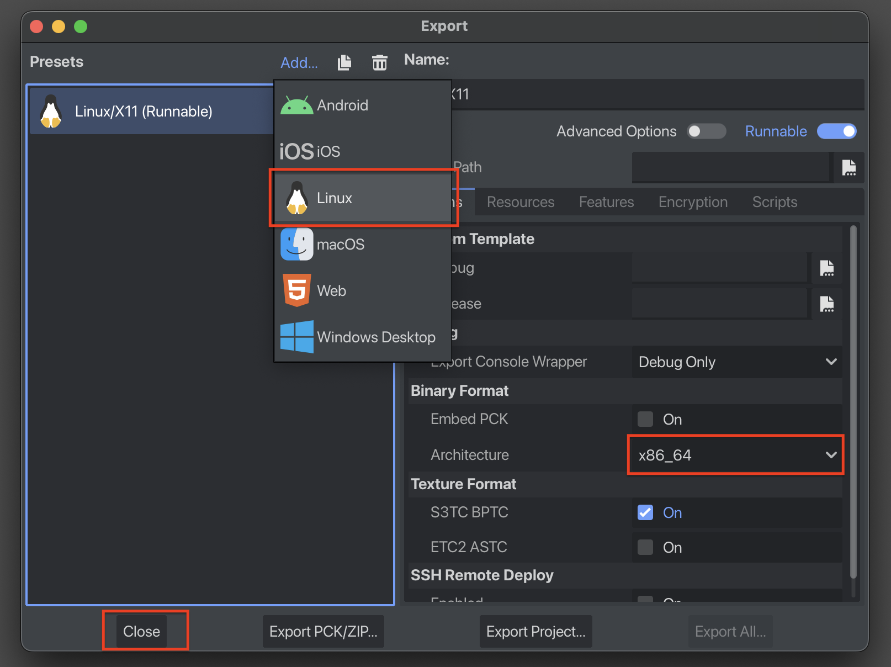

Hathora Godot
===========
This Godot addon includes:
* Hathora editor plugin to configure, build, and deploy your server directly from the Godot editor
* Hathora GDScript SDK for programmatic integration


This README covers:
* [Installation](#installation)
* [First deployment](#first-deployment)
* [SDK endpoints](#sdk-endpoints)
* [Configuration](#configuration)
* [Calling API endpoints](#calling-api-endpoints)
* [SDK Example usage](#sdk-example-usage)
* [Version compatibility](#version-compatibility)

## Installation
Download the addon from the [releases page](https://github.com/hathora/hathora-godot-plugin/releases/latest), unzip, and move the resulting folder to your Godot project root. The `plugin` and `sdk` folders should be inside `<your-project-root>/addons/hathora`. The plugin and SDK are independent, you do not need to install both.

After installing the addon, open the Project Settings, and enable it under the Plugins tab.


## First deployment
### 1. Login
Press **"Login to Hathora"** and complete the login on the browser window that opens


### 2. Create a new application
Press **"Console"** to open the Hathora Console and create a new application


Refresh the target applications in the plugin, your newly created application will appear


### 3. Create an export preset
The plugin supports Linux x86_64 or Linux x86_32 export presets



> [!TIP]
> For instructions on how to set up your export preset, see [Godot's tutorial on exporting for dedicated servers](https://docs.godotengine.org/en/stable/tutorials/export/exporting_for_dedicated_servers.html)

Open Godot's Export menu and create a new preset. Once you have created an export preset, go back to the plugin, refresh the export presets list, and select your newly created preset.

### 4. Generate a server build
Press **"Generate Server Build"**
> [!TIP]
> This step will automatically generate a Dockerfile for you, which should work out of the box. You can extend this Dockerfile as needed in the future. For more on Dockerfiles, check out [these docs](https://hathora.dev/docs/guides/create-dockerfile).

To confirm that the build was generated successfully, you can check out the "**Generate Server Build logs**" output in the plugin.


### 5. Adjust the Deployment Settings
The "Container port" you enter should match the port your server is listening on. In Godot, the server port is usually specified when calling the `create_server()` function on an ENetMultiplayerPeer instance, like so:
```gdscript
const SERVER_PORT = 7777

func start_server() -> void:
	var peer = ENetMultiplayerPeer.new()

	# The container port in the Hathora Deployment Settings should match SERVER_PORT
	var error = peer.create_server(SERVER_PORT, MAX_CONNECTIONS)
	if error:
		return
	multiplayer.multiplayer_peer = peer
```

Also, [ENetMultiplayerPeer](https://docs.godotengine.org/en/stable/classes/class_enetmultiplayerpeer.html) uses UDP for its connections, so for this example your settings should be:

- Container port: `7777`
- Transport type: `UDP`

### 6. Deploy
Press **"Deploy to Hathora"**, the plugin will automatically upload your server build and deploy it on Hathora. It may take a few minutes.

### 7. Test your deployment
When you press **"Create Room"**, Hathora will spin up a server instance and will return a `host:port` (e.g. `d405b3.edge.hathora.dev:58554`) for clients to connect to. Once you are able to test an end-to-end deployment and connection, you can use the Hathora Godot SDK to fully integrate with your game!

## SDK endpoints
The SDK includes a HathoraSDK autoload, with the following functions:
* room_v2
	* create
	* get_info
	* get_active
	* get_inactive
	* destroy
	* suspend
	* get_connection_info
	* update_config
* auth_v1
	* login_anonymous
	* login_nickname
	* login_google
* lobby_v3
	* create
	* list_active_public
	* get_info_by_room_id
	* get_info_by_short_code
* processes_v2
	* get_info
	* get_latest
* discovery_v1
	* get_ping_service_endpoints

For more information, see the [Hathora API documentation](http://hathora.dev/api).
## Configuration
Configuration is saved in two locations: the appId is in the Godot project settings, and the devToken is in the config file `<project-root>/.hathora/config` or at `<project-root>/hathora_config`.
### Specifying an appId
The SDK uses the appId specified under `Project Settings > Hathora > App Id`. When you select a target application in the plugin, its appId is automatically applied to the project settings. Alternatively, you can specify an appId by calling `HathoraSDK.set_app_id(app_id)`.

### Specifying a devToken

> [!WARNING]
> The devToken gives privileged access to your Hathora account. Never include the devToken in client builds or in your versioning system.

When the SDK or the plugin are enabled in your project for the first time, a config file is generated at `<project-root>/.hathora/config`. For endpoints that require it, the SDK uses the devToken specified at `<project-root>/.hathora/config`. You may edit this file manually, or by using the plugin (`Developer Settings > Developer token`). Alternatively, you can call `HathoraSDK.set_dev_token(dev_token)`. By default, Godot project exports will omit the config file. If "Include Hathora config" is enabled while generating a server build through the plugin, a copy of the devToken will be saved at `<project-root>/hathora_config`. The SDK automatically looks for a devToken at `<project-root>/hathora_config` on startup.

## Calling API endpoints
```gdscript
func create_lobby() -> bool:
	last_error = ""

	# Create a public lobby using a previously obtained playerAuth token
	# The function will pause until a result is obtained
	var lobby_result = await HathoraSDK.lobby_v3.create(login_token, Hathora.Visibility.PUBLIC, Hathora.Region.FRANKFURT, {}).async()
	
	# Having obtained a result, the function continues
	# If there was an error, store the error message and return
	if lobby_result.is_error():
		last_error = lobby_result.as_error().message
		return false

	# Store the data contained in the Result
	lobby_data = result.get_data()
	print("Created lobby with roomId ", lobby_data.roomId)
	return true
```
Note the `async()` call. Calling `HathoraSDK.lobby_v3.create()` returns a Request object. Calling `async()` on the Request object allows you to pause the execution of the function by using the `await` keyword, until a result is obtained. The `is_error()` function returns true if there was an error. Finally, `lobby_result.as_error().message` allows you to store the error message and display it to the user. All endpoints contained in the SDK can be called using this pattern.

## SDK Example usage
This snippet shows how to log in and join a lobby by its shortCode:
```gdscript
var player_nickname = "Nickname"
var lobby_short_code = "1234"
var token:= ""

# Player requesting to join a lobby
func _on_join_lobby_requested() -> void:
	# Logging in the player
	if token.is_empty():
		var res = await HathoraSDK.auth_v1.login_nickname(player_nickname).async()
		if res.is_error():
			print(res.as_error().message)
			return

		token = res.get_data().token
	
	# Getting the roomId from the lobby shortCode
	var res = await HathoraSDK.lobby_v3.get_info_by_short_code(token, lobby_short_code).async()
	if res.is_error():
		print(res.as_error().message)
		return

	join_room_id(res.get_data().roomId)
	
# Joining the room by its roomId
func join_room_id(room_id: String) -> void:
	
	# Getting the connection info for the room
	var res = await HathoraSDK.room_v2.get_connection_info(room_id).async()
	if res.is_error():
		print(res.as_error().message)
		return

	var connection_info = res.get_data()

	# If the roomStatus is not yet ACTIVE, we try again
	if connection_info.status != Hathora.RoomStatus.ACTIVE:
		join_room_id(room_id)
		return
	
	# Creating a multiplayer peer using the exposed host and port
	var peer = ENetMultiplayerPeer.new()
	var err = peer.create_client(connection_info.exposedPort.host, connection_info.exposedPort.port)
	if err:
		print(str(err))
		return

	multiplayer.multiplayer_peer = peer
	await multiplayer.connected_to_server
	print("Connected!")
```
## Questions?

Get help and ask questions in our active Discord community:
[https://discord.com/invite/hathora](https://discord.com/invite/hathora)

## Version compatibility

This addon is compatible with Godot 4.2+

## Credits

**Davide Di Staso** (Lead developer - Godot plugin & SDK)

**Justin Chu**
